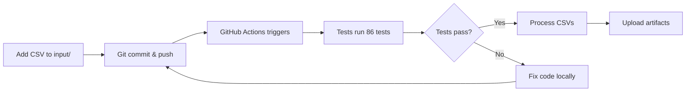

# GitHub Actions Setup Guide

## ✅ What You've Already Done

You've successfully pushed your project to GitHub! The repository includes:
- ✅ All Python source code (`server/src/`)
- ✅ Test suite with 86 tests (`server/tests/`)
- ✅ GitHub Actions workflow (`.github/workflows/csv-pipeline.yml`)
- ✅ Documentation (README.md, QUICK_START.md)
- ✅ `.gitignore` file to exclude unnecessary files

## 🚀 Next Steps

### 1. **Create Output Directory Placeholder**

GitHub doesn't track empty directories, so create a placeholder:

```bash
cd server/output
New-Item .gitkeep -ItemType File
cd ../..
git add server/output/.gitkeep
git commit -m "Add output directory placeholder"
git push
```

### 2. **Verify GitHub Actions is Enabled**

1. Go to your GitHub repository
2. Click the **"Actions"** tab
3. If you see a message about workflows being disabled, click **"I understand my workflows, go ahead and enable them"**

### 3. **Test the Workflow Manually**

**Option A: Trigger via GitHub UI**
1. Go to **Actions** tab → **CSV Processing Pipeline**
2. Click **"Run workflow"** button
3. Leave "CSV file to process" as `all` (or specify a filename)
4. Click green **"Run workflow"** button
5. Watch the workflow execute in real-time!

**Option B: Trigger by Pushing a CSV**
```bash
# Add a new CSV file to the input folder
cp some-data.csv server/input/
git add server/input/some-data.csv
git commit -m "Add new CSV for processing"
git push
```

**Option C: Trigger by Updating Code**
```bash
# Make any change to a Python file
git add server/src/pipeline.py
git commit -m "Update pipeline"
git push
```

## 🔍 Understanding the Workflow

Your workflow automatically runs when:
- ✅ You push CSV files to `server/input/`
- ✅ You push Python code changes to `server/src/`
- ✅ You create a pull request
- ✅ You manually trigger it from GitHub Actions UI

### Workflow Steps

1. **Checkout Code** - Downloads your repository
2. **Setup Python 3.11** - Installs Python environment
3. **Install Dependencies** - Installs pandas, numpy, pytest from `requirements.txt`
4. **Create Output Directory** - Prepares folder for results
5. **Process CSV Files** - Runs your pipeline on all CSVs
6. **Run Tests** - Executes 86 pytest tests (78% coverage)
7. **Upload Artifacts** - Saves generated files for download
8. **Generate Summary** - Creates a report in the Actions UI

## 📥 Accessing Results

After a workflow run completes:

1. Go to **Actions** tab → Click on the workflow run
2. Scroll to **Artifacts** section at the bottom
3. Download **"csv-processing-results"** (available for 30 days)
4. Extract the ZIP to see:
   - `*_cleaned.csv` - Cleaned data
   - `*_summary_report.csv` - Statistical summary
   - `*_json_report.json` - Comprehensive analysis
   - `*_quality_report.csv` - Quality scores
   - `*_metadata.json` - Processing metadata

## 🛠️ Customization Options

### Process Specific Files in Workflow

Edit [csv-pipeline.yml](.github/workflows/csv-pipeline.yml#L53) to target specific files:

```yaml
python pipeline.py "../input/customers-100.csv" --output ../output
```

### Auto-Commit Results Back to Repo

Uncomment lines 103-105 in [csv-pipeline.yml](.github/workflows/csv-pipeline.yml#L103):

```yaml
- name: Commit results (optional)
  if: github.event_name == 'push' && github.ref == 'refs/heads/main'
  run: |
    git config --local user.email "action@github.com"
    git config --local user.name "GitHub Action"
    git add server/output/*
    git diff --staged --quiet || git commit -m "Auto-update: CSV processing results [skip ci]"
    git push  # ← Uncomment this line
```

### Add Slack/Email Notifications

Add this step to notify you when processing completes:

```yaml
- name: Notify completion
  uses: 8398a7/action-slack@v3
  with:
    status: ${{ job.status }}
    webhook_url: ${{ secrets.SLACK_WEBHOOK }}
```

## 🧪 Local Testing Before Push

Always test locally first:

```bash
cd server/src

# Activate virtual environment
.\venv\Scripts\Activate

# Run tests
cd ..
pytest tests/ -v --cov=src

# Run pipeline
cd src
python pipeline.py --dir ../input --output ../output
```

## 📊 Monitoring Workflow Runs

### View Logs
1. **Actions** tab → Click workflow run → Click job name
2. Expand each step to see detailed logs
3. Look for errors in red-highlighted sections

### Check Test Results
The workflow will fail if any of the 86 tests fail - this protects you from deploying broken code!

### Download Coverage Report
Coverage reports are included in the artifacts for detailed analysis.

## 🔒 Security Best Practices

1. **Never commit sensitive data** in CSV files (passwords, API keys, etc.)
2. **Review CSV files** before pushing to ensure they contain appropriate data
3. **Use branch protection** to require passing tests before merging
4. **Use GitHub Secrets** for any credentials (Settings → Secrets and variables → Actions)

## 🎯 Recommended Workflow



1. Add CSV files to `server/input/`
2. Commit and push to GitHub
3. GitHub Actions automatically runs
4. Tests validate code (86 tests, 78% coverage)
5. Pipeline processes all CSV files
6. Download results from Artifacts section
7. Review quality scores and cleaned data

## 🆘 Troubleshooting

### Workflow Not Running?
- Check **Actions** tab is enabled
- Verify file paths match workflow triggers
- Check workflow file syntax with GitHub's workflow editor

### Tests Failing?
- Run `pytest tests/ -v` locally first
- Check logs in Actions tab for specific failures
- Ensure all dependencies are in `requirements.txt`

### Processing Errors?
- Verify CSV files are valid UTF-8
- Check column names don't have special characters
- Review logs in Actions tab under "Process CSV files" step

## 📚 Additional Resources

- [GitHub Actions Documentation](https://docs.github.com/en/actions)
- [Python Package Index](https://pypi.org/) for additional libraries
- [Pandas Documentation](https://pandas.pydata.org/docs/)
- [Pytest Documentation](https://docs.pytest.org/)

---

**You're all set! 🎉** Your CI/CD pipeline is production-ready and will automatically process CSV files whenever you push changes.
